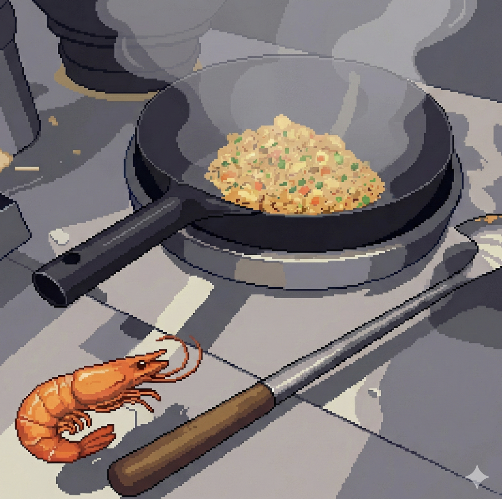

# The Shrimp Fried the Rice: How a Cooking Wok Became a Game Controller

**An experimental game about role reversal, physical computing, and the gap between "it works" and "it feels right."**

*Carl Vincent Kho · GDC Alt. Ctrl. Prototype · February 2026*



---

Benny tilted his phone, watched a pixel shrimp slide across a virtual wok, flicked upward, and grinned. Half the sensor pipeline was still held together with ngrok and a prayer, but the toss *felt right*. That grin is what I'd been building toward for three weeks.

The game is called **Shrimp Fried Rice**. You play as a shrimp navigating a hot wok using your phone's gyroscope, collect MSG power-ups, fight the chef, and eventually *become* the chef defending your kitchen from waves of greedy human hands. The title is the punchline: **the shrimp fried the rice**.

Here's what I built and what broke.

---

## Why a Wok?

The idea came from a design constraint, not inspiration. Professor Watson's Game Design course (GDC Alt. Ctrl. Prototype assignment) asked us to think about non-standard controllers. Most of my classmates reached for interesting *output* mechanics. I got stuck on the input.

I'd been wandering through Gong Hua Digital Plaza in Taiwan, where you can buy an MPU-6050 six-axis gyroscope for less than a cup of coffee. I was already holding an IMU board when I spotted a wok at a kitchen stall across the aisle. The proximity was the design: what if the *medium of play* was the cooking motion itself?

Tilt, toss, and shake map onto three game mechanics: *movement, jump, and attack*. "Naturally" is doing a lot of work in that sentence. The calibration system I ended up building — a 3-flick normalization routine that maps each player's personal toss strength to the game's physics — is the invisible hero of the project. Without it, the same flick that registers as a gentle toss on my phone produces a violent 30g spike on someone else's.

---

## The Architecture Nobody Notices

The game is **four files**. No framework, no build step, no server-side runtime:

```
build/
├── index.html    ← Shell + all screens
├── config.js     ← Tunable constants
├── game.js       ← 1400 lines of vanilla JS
└── style.css     ← Styling
```

Everything runs in the browser. Audio is procedurally generated via the Web Audio API—10 distinct sound types, zero audio files. The sizzle when the shrimp rests on the hot wok is white noise filtered through a highpass at 800Hz with gain inversely proportional to velocity — the faster you move, the quieter it gets. Watson calls this "juice": screen shake, slow-mo on swat, procedural audio. Individually they're fine. Together, each physical gesture feels like it actually landed.

The sensor pipeline is where it gets interesting. The game supports three input modes simultaneously:

1. **Phone sensors** (direct) — `DeviceOrientationEvent` for tilt, `DeviceMotionEvent` for toss/swat detection
2. **Remote controller via WebSocket** — A phone connects to a relay server, sends sensor data to the game display on a laptop
3. **ESP32 hardware wok** — MPU-6050 gyroscope + 4 piezo discs for hit zone detection, over WiFi

All three modes feed into the same unified `processMotion()` function. The game doesn't care where the data comes from.

---

## The QR Code Pipeline (And Why It Matters)

The single most impactful UX improvement was adding a QR code to the title screen. Here's the flow:

1. The game opens on a laptop (the "display")
2. Player clicks **GENERATE ROOM CODE**
3. A WebSocket connection opens to a combined server (`serve.js` — static files + relay on one port)
4. The server assigns a random 4-digit room code
5. The game generates a QR code encoding: `https://{ngrok-url}/controller.html?relay={host}&code={room}`
6. The player scans the QR code with their phone
7. The controller page auto-connects, requests sensor permissions, and starts streaming orientation/motion data
8. The game display receives sensor data in real-time and drives the shrimp

**Scan, allow sensors, play.** Five seconds total.

This solved the actual hard problem: *getting a phone's sensors into a desktop browser over HTTPS*. Sensors require a secure context (`DeviceMotionEvent` only works on HTTPS origins). Local development means ngrok. And ngrok means a different URL every session. The QR code encodes the ephemeral URL, so the player never has to type `https://888c-183-82-51-162.ngrok-free.app/controller.html?relay=888c-183-82-51-162.ngrok-free.app&code=5428` on a phone keyboard. They just point their camera.

During our class playtest session, I distributed the game to 7 phones simultaneously: iPhone 16 Pro Max, iPhone 13 Pro, Pixel 6 Pro, iPhone 12, iPhone SE (2024), iPhone 16, and iPhone 15. The QR code was the only reason this was possible in under a minute. Without it, I would have spent the entire session dictating URLs.

---

## Cross-Device Compatibility: The Boring Miracle

This section is about bugs, because the bugs are where the learning is.

**iOS Safari** requires explicit permission requests for both `DeviceOrientationEvent` *and* `DeviceMotionEvent`. You must call `DeviceOrientationEvent.requestPermission()` from a user gesture (button tap). My v0.3 only requested orientation permission. Tilt worked. Toss didn't. It took 45 minutes of debugging across two iPhones to figure out that *motion is a separate permission*.

**Android Chrome** auto-grants sensor access over HTTPS—no permission prompt. But some builds of Chrome require navigating to `chrome://flags` and enabling "Generic Sensor Extra Classes." There's no error. The events just don't fire. The sensor debug overlay I built (toggle with the 🐛 button) saved hours here—it shows real-time orientation, acceleration, magnitude, threshold, device type, and permission status on every screen, including the title screen.

**The combo that broke everything**: iPhone SE (2024) + Safari + ngrok free tier. Safari's privacy settings blocked the ngrok intermediary page (the "visit site" warning). The permission request fired, the user tapped "Allow," and then the page reloaded because of the ngrok warning—wiping the permission state. Fix: have the user tap through the ngrok warning *first*, then tap COOK.

Seven devices. Seven different failure modes. Every single one was discovered by a human playtester physically holding a phone. No emulator in the world would have caught these.

---

## Three Stages of Role Reversal

### Stage 1: Survive the Wok

You're a shrimp in a hot wok. Tilt to slide, toss to jump. Oil drops keep you alive. Red hazards drain your health. Collect 5 MSG crystals to progress. This is the calibration stage in disguise—by the time the player has collected 5 MSG, they've internalized tilt, toss, and the wok's circular boundary physics.

### Stage 2: Swat the Chef

The chef reaches into the wok. You can ram his hand while airborne or swat it away with a hard shake. The mechanic mirrors real cooking—you're a shrimp fighting back against the hand stirring the wok. 4 HP. Defeat him to trigger the reversal.

### Stage 3: Defend Your Wok

**The Rataouille moment.** The MSG transforms you. You wear a chef hat now. The same wok, the same mechanics, but flipped: now *you* are the chef, and waves of human hands reach in from outside the rim to steal your ingredients. 3 escalating waves (2 → 3 → 5 hands), increasingly fast. Same tilt/toss/swat vocabulary—no new cognitive load.

Watson's feedback on this stage redesign was pivotal. The original v0.4 was "Kitchen Pandemonium"—a 4-column kitchen management game with order cards and station systems. It was ambitious, confusing, and required an entirely new set of mechanics. Watson pointed us to *Froggy's Battle* as a model: same core loop, escalating challenge, upgrade paths. The wave defense redesign (v0.5) cut scope, increased polish, and—critically—reused the physical gestures the player had already learned.

---

## What I actually took away

The controller is the design, not a delivery mechanism for the design. The same tilt mechanic on a keyboard and on a physical wok are two completely different games — not because the code changes, but because your body changes. I didn't fully understand that until I watched someone try to play with their wrist, then their elbow, then their whole arm.

Calibration is UX nobody sees. My 3-flick normalization routine — average the player's natural flick strength, set toss at 60%, swat at 110% — is probably the most important thing I wrote. Nobody knows it exists. That's the point.

You cannot emulate a person holding a phone. Seven human bodies found seven different failure modes. No automated test would have touched any of them.

Juice compounds in a way I didn't expect. Screen shake, slow-mo on swat, procedural sizzle, haptic feedback — each one alone is fine. Together they make the toss feel *real*, which means the physical gesture actually means something. That's Watson's "every subsystem has to be fun" in practice.

The part I didn't anticipate: this project is structurally identical to my capstone thesis. SOMACH maps EMG signals from the throat into digital commands via electrode normalization. The wok maps accelerometer spikes into game inputs via flick normalization. Same problem, different signal source. I only realized it halfway through building the calibration screen.

---

## Technical Specs

| Component | Details |
|-----------|---------|
| **Game Engine** | Vanilla JavaScript, Canvas 2D, Web Audio API |
| **Controller (Phone)** | `DeviceOrientationEvent` + `DeviceMotionEvent` over WebSocket |
| **Controller (Hardware)** | ESP32 + MPU-6050 + 4× Piezo discs via WebSocket |
| **Relay** | Node.js WebSocket server (20 lines of relay logic) |
| **Hosting** | Static files — works on Vercel, Netlify, itch.io, GitHub Pages |
| **Audio** | 10 procedural sound types, zero audio files |
| **Compatibility** | Tested on 10+ devices (iPhone 12–16 Pro Max, Pixel 6 Pro/9a, iPhone SE 2024) |

---

## Play It

- **Play in browser**: [gamedev-watson-26hyd.vercel.app/shrimp-fried-rice.html](https://gamedev-watson-26hyd.vercel.app/shrimp-fried-rice.html)
- **itch.io**: [carlcrafterz.itch.io/shrimp-fried-rice-draft](https://carlcrafterz.itch.io/shrimp-fried-rice-draft)
- **Source (build folder)**: [github.com/CarlKho-Minerva/gamedev-watson_26hyd/tree/main/game-3/build](https://github.com/CarlKho-Minerva/gamedev-watson_26hyd/tree/main/game-3/build)
- **Hardware Build Guide**: [Wok Controller Instructable](https://gamedev-watson-26hyd.vercel.app/instructables_wok_controller.html) — ESP32 assembly, wiring, BOM

---

*Special thanks to the playtesters: Benny, Dain, Chelsea, Angela, Manu, Laryssa, Jack, Nokutenda, Stiven, Artem. You held the phones. That was the hard part.*

*And to Professor Watson, whose feedback on v0.4 prompted the Stage 3 redesign that made the game actually work: "Every subsystem has to be fun." Still learning what that means.*
